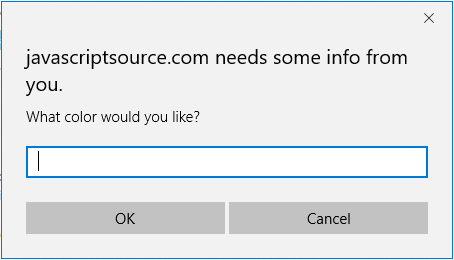

# mouseover-bg
Throwback to my first online code contribution: a quick script on JavaScriptSource which prompts the user for a color to reset the background.

Try it: http://scnz.co/mouseover-bg/

Original post on Wayback Machine: [http://www.javascriptsource.com/image-effects/mouseover-bg-selector.html](https://web.archive.org/web/20150906210702/http://www.javascriptsource.com/image-effects/mouseover-bg-selector.html)
